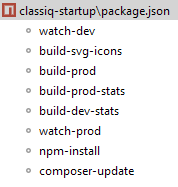

#Classiq startup
L'objectif de ce repo est de vous permettre d'installer le CMS Classiq en un minimum de temps.
Le CMS une fois installé offre un site volontairement simple et qui contient les fonctionnalités suivantes:
* site anglais / français
* page d'accueil
* page exemple
* 404 qui redirige vers la home
* Une inderface d'administration WYSIWYG
* quelques blocks
    * Titre
    * Texte
    * Image
    * Iframe
    * liste de pages
    * grille de photos
    


##Prérequis

On part du principe que sur votre machine sont installés:
* php 7
* apache
* composer
* node js

##Installation

###Librairies

Vous pouvez installer tout ce qui est nécessaire à partir du package.json.


```
//Lancez les commandes:
npm-install
composer-update
build-svg-icons (qui génère des libriarie d'icones svg)
watch-dev (qui compile automatiquement les fichiers less et javascript dans le répertoire /dist)
```
Une fois tout installé vous devez avoir des répéertoires
* vendor (les librairies php installées depuis composer)
* node_module (les librairies node js qui vous permettront de vous amuser avec webpack, less css, etc...)

###Dans votre navigateur
Allez sur :

`http://la-ou-est/configuré-votre/document-root/_install.php`

Ceci devrait générer dans le répertoire `configs/routes` les fichiers de config pour votre site en Français et en Anglais.

Pour voir vos sites en anglais et en français allez sur :

* `http://la-ou-est/configuré-votre/document-root/en`
* `http://la-ou-est/configuré-votre/document-root/fr`

##Traductions

### Traductions d'interface
* Allez sur `https://docs.google.com/spreadsheets/d/1kefhXt0Z7g0P2cGItQK4k_hqhSoFTMaJyvzNYjKeqw8`
* Copiez le google sheet afin de pouvoir le modifier
* Modifiez l'url dans vos fichiers de config (`configs/routes/etc..`)

##Connectez-vous
* Allez sur `http://la-ou-est/configuré-votre/document-root/fr/login`
* identifiez-vous avec 
    * email: `admin@admin.com`
    * mot de passe: `admin`
    
    

##Mise en ligne

###Configuration de vos domaines et répertoires

Dans le répertoire `configs/routes` vous trouverez un système de fichier qui reflète votre installation en local.
Inspirez vous de ce système de fichiers pour votre mise en ligne.

###Répertoires et fichiers

Voici la liste des répertoires et fichiers à uploader.
```
|- configs
|- dist
|- files
|- files
|- project
|- vendor
|- .htaccess
|- favicon.ico
|- index.php
```

###Options et performaces

####SEO
Dans la config des chacun de vos domaines ou répertoires;
```
//activer ou non le référencement naturel
the()->configProjectUrl->seoActive=true; 

//Configurer (ou pas) Google webmaster tools
//site()->googleSiteVerification="xxxxx";

//Configurer (ou pas) Google analytics
//site()->googleAnalyticsId="UA-xxxxxx";
```

####Performances et debuggage
Dans la config des chacun de vos domaines ou répertoires;
```
//En mettant sur false on ne va pas télécharger le csv des traductions, on garde la version en cache.
the()->project->config_translations_debug=false;
```


